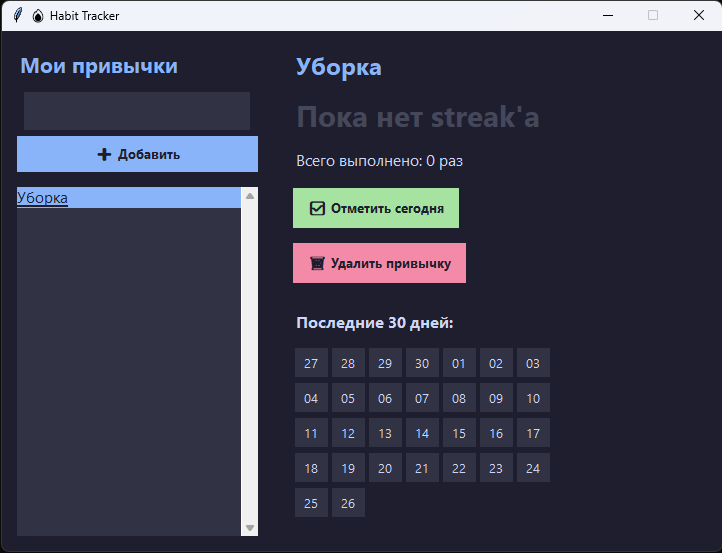

# 🔥 Habit Tracker GUI

<p align="center">
  
  
  
</p>

<p align="center">
  <b>Настольное приложение для отслеживания привычек с тёмной темой и визуальным календарём.</b><br>
  Никаких регистраций, баз данных и API-ключей — всё хранится локально.
</p>
---



---

## ✨ Возможности

- 📝 **Добавление привычек** — быстро, одним нажатием Enter
- ✅ **Отметка выполнения** — одна кнопка = один день
- 🔥 **Streak-счётчик** — показывает, сколько дней подряд ты не пропускал
- 📅 **Визуальный календарь** — 30 дней в виде цветных клеток (зелёный = выполнено)
- 🗑 **Удаление** — с подтверждением, чтобы случайно не стереть
- 💾 **Автосохранение** — данные не пропадут при закрытии
- 🌙 **Тёмная тема** — приятная для глаз, работает ночью

---

## 🛠 Технологический стек

| Компонент | Описание |
|-----------|----------|
| **Python 3.8+** | Язык программирования |
| **tkinter** | Встроенная библиотека GUI (ничего устанавливать не надо) |
| **JSON** | Формат хранения данных |
| **pyinstaller** | Для сборки в `.exe` (опционально) |

---

## 🚀 Быстрый старт

### 1. Клонируй репозиторий

```bash
git clone https://github.com/ТВОЙ_NICKNAME/habit-tracker-cli.git
cd habit-tracker-cli
```

### 2. Запусти приложение

```bash
python habit-tracker-cli.py
```

> 💡 **Важно:** файл `habits.json` создаётся автоматически в папке `Документы/HabitTracker/`. В репозиторий он не попадает (добавлен в `.gitignore`).

---

## 📖 Как пользоваться

| Действие | Что делать |
|----------|------------|
| **Добавить привычку** | Напиши название в верхнее поле слева → нажми **➕ Добавить** (или `Enter`) |
| **Выбрать привычку** | Кликни на неё в списке |
| **Отметить выполнение** | Нажми зелёную кнопку **✅ Отметить сегодня** |
| **Посмотреть прогресс** | Зелёные клетки = выполнено, серые = пропущено |
| **Удалить привычку** | Выбери привычку → нажми **🗑 Удалить** |

### Что такое Streak 🔥

Это счётчик **дней подряд**. Если отмечаешь привычку каждый день — цифра растёт. Пропустил день — сбросится в 0.

---

## 🪟 Сборка в .exe (Windows)

Чтобы приложение запускалось двойным кликом без Python:

### 1. Установи pyinstaller

```bash
pip install pyinstaller
```

### 2. Собери exe

```bash
pyinstaller --onefile --windowed --name "HabitTracker" habit-tracker-cli.py
```

### 3. Забери готовый файл

Готовый `HabitTracker.exe` появится в папке `dist/`. Можешь перенести его куда угодно — он работает сам по себе.

> ⚠️ **Примечание:** некоторые антивирусы могут реагировать на `.exe`, собранный pyinstaller. Это ложное срабатывание — добавь файл в исключения или используй исходный `.py`.

---

## 📁 Структура проекта

```
habit-tracker-cli/
├── habit-tracker-cli.py    # Исходный код приложения
├── .gitignore              # Файлы, которые не попадают на GitHub
├── README.md               # Этот файл
└── dist/                   # Папка с .exe (создаётся при сборке, игнорируется Git)
```

## 📄 Лицензия

MIT — делай с кодом что хочешь. Указывать авторство необязательно, но приятно 😊

---

<p align="center">
  Сделано с 🔥 для трекинга привычек
</p>
